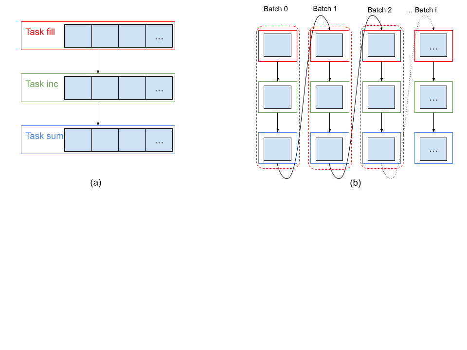

..
  SPDX-FileCopyrightText: Copyright (c) 2022-2026 NVIDIA CORPORATION & AFFILIATES. All rights reserved.
  SPDX-License-Identifier: Apache-2.0

.. _sec_runtime_streaming:

Streaming in Legate
===================

Streaming is a new execution mode in the Legate runtime that (under certain conditions)
allows a series of operations to execute in batches, ultimately allowing the same series
of operations to run using less memory.  Under standard execution mode, if a task produces
a result for a subsequent task that consumes it, the consumer task cannot start until the
producer task has finished execution, due to the data dependency. With Streaming, the data
dependencies are applied at a finer level, where a **producer** task is submitted in
batches, where each batch operates over a subset of data, which produces partial results
and allows, under certain conditions, a subsequent **consumer** task to start early and
consume those results.

This typically results in a lower memory footprint because the temporary data created
during the execution is typically smaller in size, proportional to the batch size, and can
be discarded after use.  For example, suppose that we wanted to load two very large
vectors (``x`` and ``y``) from disk, add them together, and store the result in a third
vector (``r``), i.e. ``r = x[:] + y[:]``.  Under streaming, we can load a batch of ``x``,
and a batch of ``y`` to produce a batch of ``r`` and then discard the ``x`` and ``y``
batches.

This feature is experimental and does not yet support all use-cases. Invalid use may lead
to exceptions, hangs, or outright crashes. Upcoming releases will focus on rounding out
this feature, adding safety checks etc.

.. code:: py

   import cupynumeric as np

   A = np.ones(1024 * 1024) # FILL Task
   A = A + 1 # INC Task
   s = A.sum() # SUM Task

We will describe the Streaming schedule with an example code shown above. The code
consists of three tasks (FILL, INC, SUM) that operate on the same array. Figure (a) below
shows the execution without Streaming, where a task like FILL is scheduled on the entire
array.  The dependent task (INC) can only start executing when FILL has completed its
execution. With Streaming, shown in Figure (b), the Legate runtime will decompose the
array into smaller batches and schedule a separate FILL task for each batch, followed by
INC and SUM tasks similarly. This is a valid schedule as long as the consumer task, e.g,
INC, depends only on one batch of the data that was produced by the producer task FILL.
Therefore, Streaming places some restrictions on tasks and their dependencies, which we
discuss later on.

Streaming Syntax
----------------

Streaming in Legate is enabled inside a Scope by setting the ParallelPolicy member with
the ``streaming`` flag set to ``true``.  Additionally, the users can optionally set the
``over_decompose_factor``, which decides the number of batches. Without Streaming, Legate
partitions data such that each processor gets one partition of the data.  With the
'over_decompose_factor', the amount of partitions is increased by this factor. For
example, on 8 processors, with over_decompose_factor=4, a 1MB array will be partitioned
into 32 partitions of 32KB each. Therefore, ``over_decompose_factor`` determines the batch
size. The snippets below show how the Scope can be used with ParallelPolicy to enable
Streaming inside the scope.

.. code:: py

   from legate.core import ParallelPolicy, Scope

   pp = ParallelPolicy(streaming=True, over_decompose_factor=4)
   with Scope(paralle_policy=pp):
       # submit task 1
       # submit task 2
       # ...

.. code:: cpp

   {
     auto pp = legate::ParallelPolicy{}
                  .with_streaming(true)
                  .with_over_decompose_factor(4);
     auto s = legate::Scope{}.with_parallel_policy(pp);
     // submit task 1
     // submit task 2
     // ...
   }

Streaming Restrictions
----------------------

For Streaming to be valid, the partial execution of tasks must respect the dependencies of
the original program order, i.e., without streaming.  This results in restrictions on what
task patterns are permitted inside a Streaming Scope. The restrictions themselves are hard
to precisely describe because a user generally does not have visibility into the
partitioning and scheduling decisions made by the Legate Runtime. In this section, we
first describe the theory that motivates these restrictions and then provide a list of
concrete program patterns in Legate that will likely violate the program dependencies
inside a Streaming Scope. In the future, Legate will include a checker for Streaming
execution to provide feedback to users when streaming execution cannot be performed.

**Theory:** For a Streaming Scope to be valid, i.e., respect the original program order,
the following conditions must hold:

1. Each task must launch the same number of workers. This is a limitation of current
   implementation and should go away in the future.  2. Each sub-task must read and/or
   update at most one partition of a store. If a task depends on more than one partition
   of a store that is updated by a preceding task (in the program order), the streaming
   schedule is not valid for such a program.

1. Partitioning of a store must not change from one task to another task. Changing the
   partitioning may violate the aforementioned condition of depending on at most one
   partition of the store.

3. Reductions with associative operators are an exception to the above rule as long as a
   later task does not read or write the source or results of the reduction.

**Practice:** Here, we describe a set of guidelines that a user should follow for tasks
inside a Streaming Scope. These guidelines may be imprecise and overly restrictive in some
cases

1. **Manipulating data of different shapes:** The shape of the data determines the shape
   of the parallel launch for the task. Using data of different shapes may result in
   violating the condition 1 above.  2. **Using Partitioning Constraints:** Certain
   partitioning constraints may cause a task to depend on more than one partition of the
   previous task. We discuss each kind separately:

1. **Align**: Align is OK to use as long as one variable (referring to a store or array)
   is not aligned with variables of different shapes simultaneously. For example, aligning
   the same data by rows and columns in different tasks violates condition 2 above.  2.
   **Scale:** Similar to Align 3. **Broadcast**: OK to use as long as the variable being
   broadcast is never partitioned for any tasks in the Streaming Scope.  4. **Bloat:**
   Should not be used unless the variable is read-only, as it allows overlapping
   partitions.  5. **Image:** Should not be used as the partition contents are data
   dependent and may violate conditions 1 and 2 above.

3. **Reading or over-writing the results of a reduction operation:** If a task attempts to
   read or write the results of a reduction, this will result in a race condition because
   the reduction has not completed until all batches have been executed. Therefore,
   reduction results should be read outside the Streaming Scope.
